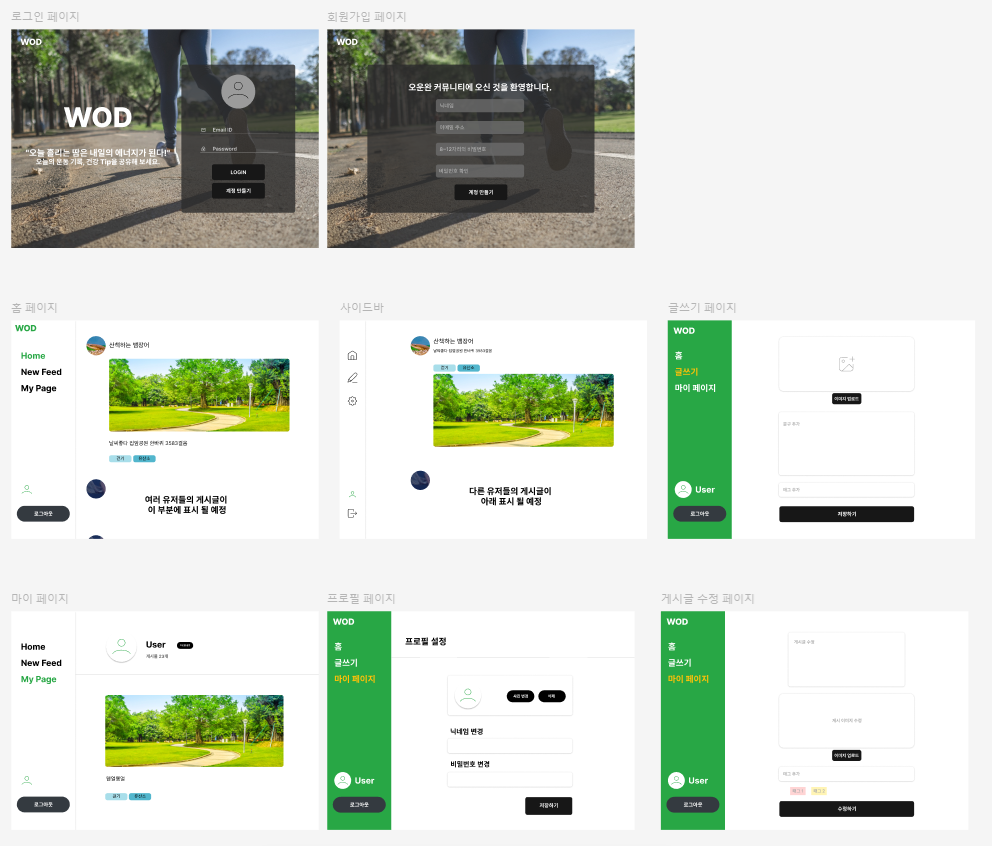
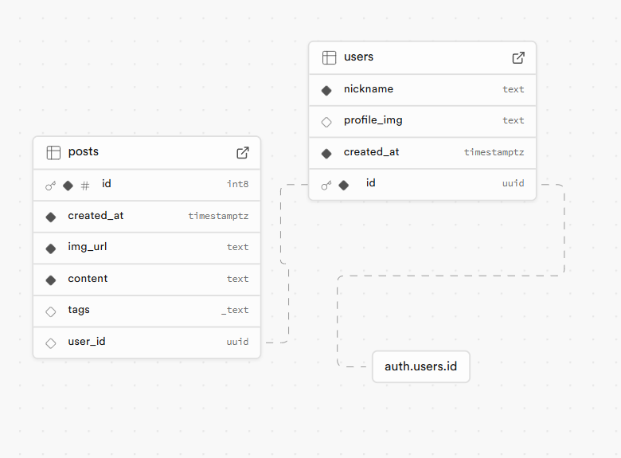

# **WOD (Workout Of the Day) - 오운완**

## 📖 목차

1. [프로젝트 소개](#프로젝트-소개)
2. [팀소개](#팀소개)
3. [프로젝트 계기](#프로젝트-계기)
4. [주요기능](#주요기능)
5. [개발기간](#개발기간)
6. [기술스택](#기술스택)
7. [와이어프레임](#와이어프레임)
8. [ERD](#ERD)

## 👨‍🏫 프로젝트 소개

WOD(Workout Of the Day)는 사용자가 자신의 운동 기록을 매일 업데이트하고 다른 사용자와 건강 정보를 공유할 수 있는 플랫폼입니다.  
이 프로젝트는 운동 목표를 설정하고, 친구들과 공유하며 동기부여와 참여를 자연스럽게 유도하는 것을 목표로 합니다.

## 팀소개

| 이름   | GitHub 링크                                    | 역할                                   |
| ------ | ---------------------------------------------- | -------------------------------------- |
| 김진실 | [@jinsil-kim](https://github.com/jinsil-kim)   | 회원가입, 프로필 설정                  |
| 구경필 | [@savewise123](https://github.com/savewise123) | 홈                                     |
| 허현석 | [@jamscreater](https://github.com/jamscreater) | 마이 페이지                            |
| 엄정은 | [@ovezen](https://github.com/ovezen)           | 레이아웃 디자인, 게시물 작성, 사이드바 |

## 프로젝트 계기

9 to 9 내일배움캠프를 진행하면서 건강하게 잘 지내고 계시나요?  
건강과 직결되는 운동은 꾸준함이 중요하지만, 혼자서 시작하거나 지속하는 건 쉽지 않습니다.  
요즘에는 많은 사람들이 습관 형성을 위해 운동 후에 ‘오운완 : 오늘 운동 완료’를 자신이 사용하는 SNS에 올리며 동기부여를 얻고 있죠.  
저희는 이런 유행에서 아이디어를 얻어, 사용자가 자신의 운동 기록을 쉽게 공유하고 다른 사용자들과 건강에 대한 정보를 나눌 수 있는 플랫폼 WOD(Workout Of the Day)를 제작했습니다.

## 🚑 주요기능

1. **회원 관리**

   - 사용자 로그인 및 회원가입 기능 제공
   - 개인 프로필 설정 가능

2. **게시글 관리 (CRUD)**

   - 사용자 운동 기록 및 건강 정보 게시글 작성
   - 게시글 수정 및 삭제 가능
   - 사용자의 개인 게시글은 "마이 페이지"에서 관리 가능

3. **일상 공유**
   - 홈 화면에서 운동 기록 및 건강 정보를 뉴스피드 형태로 공유

## ⏲️ 개발기간

- 2024.11.15(금) ~ 2024.11.21(목)

## 📚️ 기술스택

### ✔️ **Frontend**: React

사용자 인터페이스를 구축하는 프론트엔드 프레임워크로, 컴포넌트 재사용과 상태 관리를 통해 UI를 효율적으로 관리합니다.

### ✔️ **Database**: Supabase

실시간 데이터베이스로 운동 기록 및 건강 정보를 동기화하고, 사용자 피드 업데이트를 지원합니다.

### ✔️ **Styling**: Styled-components

CSS-in-JS 접근 방식을 사용하여 컴포넌트 단위의 스타일링을 효율적으로 관리합니다.

## 와이어프레임

## ERD

